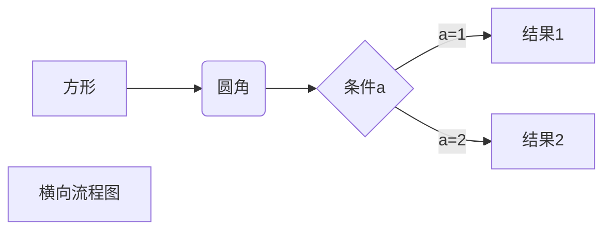
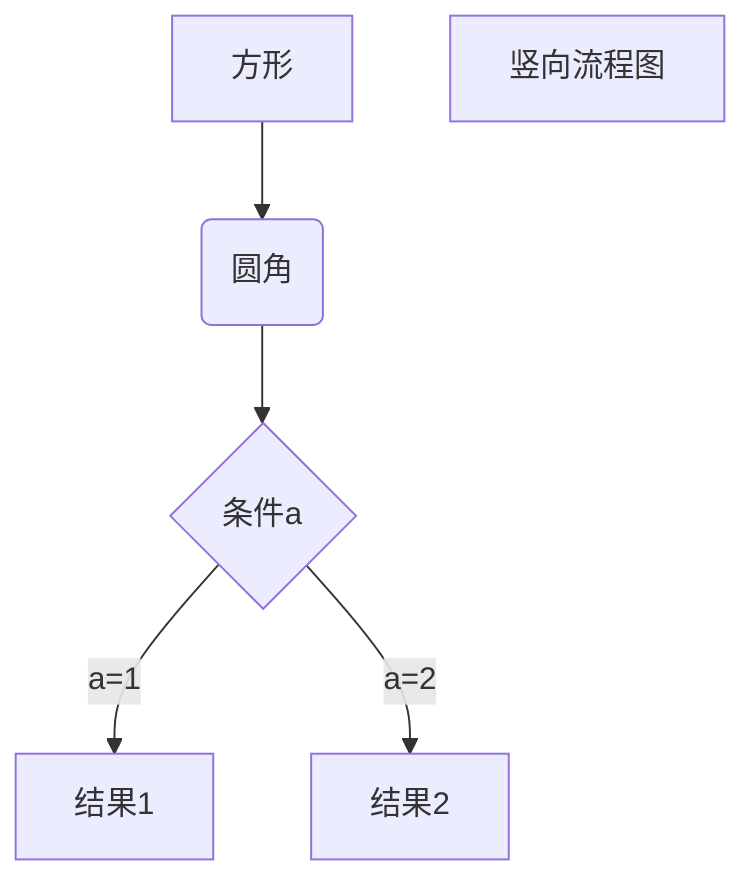
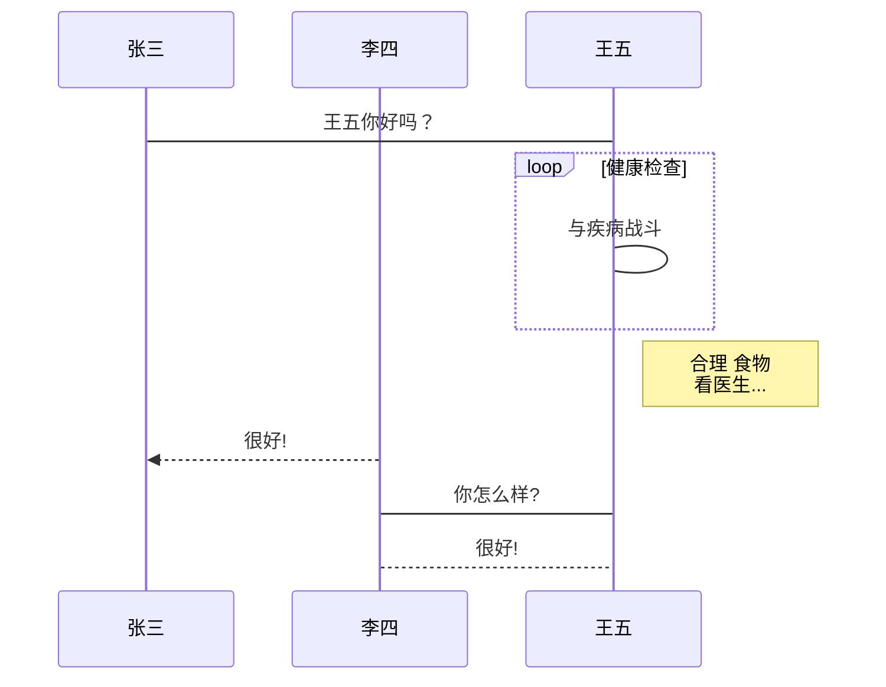
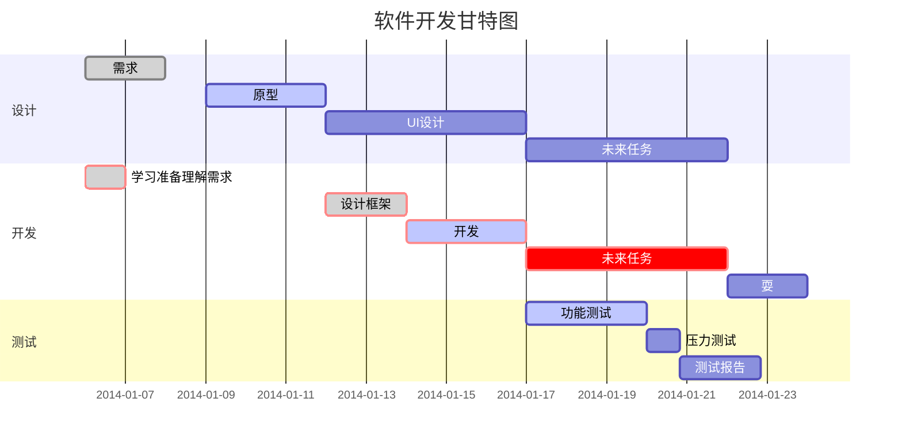

## 简介

[Markdown](http://www.markdown.cn/) 是一种可以使用普通文本编辑器编写的标记语言，通过简单的标记语法，它可以使普通文本内容具有一定的格式, Markdown 的目标是实现「易读易写」
<!--more-->
## 区块元素

段落和换行
一个 Markdown 段落是由一个或多个连续的文本行组成，它的前后要有一个以上的空行（空行的定义是显示上看起来像是空的，便会被视为空行。比方说，若某一行只包含空格和制表符，则该行也会被视为空行）。普通段落不该用空格或制表符来缩进。

「由一个或多个连续的文本行组成」这句话其实暗示了 Markdown 允许段落内的强迫换行（插入换行符），这个特性和其他大部分的 text-to-HTML 格式不一样（包括 Movable Type 的「Convert Line Breaks」选项），其它的格式会把每个换行符都转成 <br /> 标签。

如果你确实想要依赖 Markdown 来插入 <br /> 标签的话，在插入处先按入两个以上的空格然后回车。

的确，需要多费点事（多加空格）来产生 <br /> ，但是简单地「每个换行都转换为 <br />」的方法在 Markdown 中并不适合， Markdown 中 email 式的 区块引用 和多段落的 列表 在使用换行来排版的时候，不但更好用，还更方便阅读。

### 标题

Markdown 支持两种标题的语法，类 Setext 和类 atx 形式。

类 Setext 形式是用底线的形式，利用 = （最高阶标题）和 - （第二阶标题），例如：

```json
This is an H1
=============

This is an H2
-------------
```

任何数量的 = 和 - 都可以有效果。

类 Atx 形式则是在行首插入 1 到 6 个 # ，对应到标题 1 到 6 阶，例如：

```json
# 这是 H1

## 这是 H2

###### 这是 H6

```

你可以选择性地「闭合」类 atx 样式的标题，这纯粹只是美观用的，若是觉得这样看起来比较舒适，你就可以在行尾加上 #，而行尾的 # 数量也不用和开头一样（行首的井字符数量决定标题的阶数）：

```json
# 这是 H1 #

## 这是 H2 ##

### 这是 H3 ######

```

### 区块引用Blockquotes

Markdown 标记区块引用是使用类似 email 中用 > 的引用方式。如果你还熟悉在 email 信件中的引言部分，你就知道怎么在 Markdown 文件中建立一个区块引用，那会看起来像是你自己先断好行，然后在每行的最前面加上 > ：

```json
> This is a blockquote with two paragraphs. Lorem ipsum dolor sit amet,
> consectetuer adipiscing elit. Aliquam hendrerit mi posuere lectus.
> Vestibulum enim wisi, viverra nec, fringilla in, laoreet vitae, risus.
> 
> Donec sit amet nisl. Aliquam semper ipsum sit amet velit. Suspendisse
> id sem consectetuer libero luctus adipiscing.
```

效果是酱紫的：

> This is a blockquote with two paragraphs. Lorem ipsum dolor sit amet,
> consectetuer adipiscing elit. Aliquam hendrerit mi posuere lectus.
> Vestibulum enim wisi, viverra nec, fringilla in, laoreet vitae, risus.
>
> Donec sit amet nisl. Aliquam semper ipsum sit amet velit. Suspendisse
> id sem consectetuer libero luctus adipiscing.

Markdown 也允许你偷懒只在整个段落的第一行最前面加上 > ：

```json
> This is a blockquote with two paragraphs. Lorem ipsum dolor sit amet,
consectetuer adipiscing elit. Aliquam hendrerit mi posuere lectus.
Vestibulum enim wisi, viverra nec, fringilla in, laoreet vitae, risus.

> Donec sit amet nisl. Aliquam semper ipsum sit amet velit. Suspendisse
id sem consectetuer libero luctus adipiscing.
```

> This is a blockquote with two paragraphs. Lorem ipsum dolor sit amet,
consectetuer adipiscing elit. Aliquam hendrerit mi posuere lectus.
Vestibulum enim wisi, viverra nec, fringilla in, laoreet vitae, risus.

> Donec sit amet nisl. Aliquam semper ipsum sit amet velit. Suspendisse
id sem consectetuer libero luctus adipiscing.

区块引用可以嵌套（例如：引用内的引用），只要根据层次加上不同数量的 > ：

```json
 This is the first level of quoting.
>
> > This is nested blockquote.
>
> Back to the first level.
```

 This is the first level of quoting.
>
> > This is nested blockquote.
>
> Back to the first level.

引用的区块内也可以使用其他的 Markdown 语法，包括标题、列表、代码区块等：

```json
> 
> 1.   这是第一行列表项。
> 2.   这是第二行列表项。
> 
> 给出一些例子代码：
> 
>     return shell_exec("echo $input | $markdown_script");
```
>
> 1. 这是第一行列表项。
> 2. 这是第二行列表项。
>
> 给出一些例子代码：
>
>     return shell_exec("echo $input | $markdown_script");

任何像样的文本编辑器都能轻松地建立 email 型的引用。例如在 BBEdit 中，你可以选取文字后然后从选单中选择增加引用阶层。

### 列表

Markdown 支持有序列表和无序列表。

无序列表使用星号、加号或是减号作为列表标记：

```json
*   Red
*   Green
*   Blue
等同于：

+   Red
+   Green
+   Blue
也等同于：

-   Red
-   Green
-   Blue
```

* Red
* Green
* Blue

有序列表则使用数字接着一个英文句点：

```json
1.  Bird
2.  McHale
3.  Parish
```

1. Bird
2. McHale
3. Parish

很重要的一点是，你在列表标记上使用的数字并不会影响输出的 HTML 结果，上面的列表所产生的 HTML 标记为：

```json
<ol>
<li>Bird</li>
<li>McHale</li>
<li>Parish</li>
</ol>
```

如果你的列表标记写成：

```json
1.  Bird
1.  McHale
1.  Parish

或甚至是：

3. Bird
1. McHale
8. Parish
```

你都会得到完全相同的 HTML 输出。重点在于，你可以让 Markdown 文件的列表数字和输出的结果相同，或是你懒一点，你可以完全不用在意数字的正确性。

如果你使用懒惰的写法，建议第一个项目最好还是从 1. 开始，因为 Markdown 未来可能会支持有序列表的 start 属性。

列表项目标记通常是放在最左边，但是其实也可以缩进，最多 3 个空格，项目标记后面则一定要接着至少一个空格或制表符。

要让列表看起来更漂亮，你可以把内容用固定的缩进整理好：

```json
*   Lorem ipsum dolor sit amet, consectetuer adipiscing elit.
    Aliquam hendrerit mi posuere lectus. Vestibulum enim wisi,
    viverra nec, fringilla in, laoreet vitae, risus.
*   Donec sit amet nisl. Aliquam semper ipsum sit amet velit.
    Suspendisse id sem consectetuer libero luctus adipiscing.

```

但是如果你懒，那也行：

```json
*   Lorem ipsum dolor sit amet, consectetuer adipiscing elit.
Aliquam hendrerit mi posuere lectus. Vestibulum enim wisi,
viverra nec, fringilla in, laoreet vitae, risus.
*   Donec sit amet nisl. Aliquam semper ipsum sit amet velit.
Suspendisse id sem consectetuer libero luctus adipiscing.
```

* Lorem ipsum dolor sit amet, consectetuer adipiscing elit.
Aliquam hendrerit mi posuere lectus. Vestibulum enim wisi,
viverra nec, fringilla in, laoreet vitae, risus.
* Donec sit amet nisl. Aliquam semper ipsum sit amet velit.
Suspendisse id sem consectetuer libero luctus adipiscing.

如果列表项目间用空行分开，在输出 HTML 时 Markdown 就会将项目内容用 <p> 标签包起来，举例来说：

```json
*   Bird
*   Magic
```

* Bird
* Magic

会被转换为：

```json
<ul>
<li>Bird</li>
<li>Magic</li>
</ul>
```

但是这个：

```json
*   Bird

*   Magic
```

会被转换为：

```json
<ul>
<li><p>Bird</p></li>
<li><p>Magic</p></li>
</ul>
```

列表项目可以包含多个段落，每个项目下的段落都必须缩进 4 个空格或是 1 个制表符：

```json
1.  This is a list item with two paragraphs. Lorem ipsum dolor
    sit amet, consectetuer adipiscing elit. Aliquam hendrerit
    mi posuere lectus.

    Vestibulum enim wisi, viverra nec, fringilla in, laoreet
    vitae, risus. Donec sit amet nisl. Aliquam semper ipsum
    sit amet velit.

2.  Suspendisse id sem consectetuer libero luctus adipiscing.
```

1. This is a list item with two paragraphs. Lorem ipsum dolor
    sit amet, consectetuer adipiscing elit. Aliquam hendrerit
    mi posuere lectus.

    Vestibulum enim wisi, viverra nec, fringilla in, laoreet
    vitae, risus. Donec sit amet nisl. Aliquam semper ipsum
    sit amet velit.

2. Suspendisse id sem consectetuer libero luctus adipiscing.

如果你每行都有缩进，看起来会看好很多，当然，再次地，如果你很懒惰，Markdown 也允许：

```json
*   This is a list item with two paragraphs.

    This is the second paragraph in the list item. You're
only required to indent the first line. Lorem ipsum dolor
sit amet, consectetuer adipiscing elit.

*   Another item in the same list.
```

* This is a list item with two paragraphs.

    This is the second paragraph in the list item. You're
only required to indent the first line. Lorem ipsum dolor
sit amet, consectetuer adipiscing elit.

* Another item in the same list.

如果要在列表项目内放进引用，那 > 就需要缩进：

```json
*   A list item with a blockquote:

    > This is a blockquote
    > inside a list item.
```

* A list item with a blockquote:

    > This is a blockquote
    > inside a list item.

如果要放代码区块的话，该区块就需要缩进两次，也就是 8 个空格或是 2 个制表符：

```json
*   一列表项包含一个列表区块：

        <代码写在这>
```

* 一列表项包含一个列表区块：

        <代码写在这>  

当然，项目列表很可能会不小心产生，像是下面这样的写法
1986. What a great season.
换句话说，也就是在行首出现数字-句点-空白，要避免这样的状况，你可以在句点前面加上反斜杠。

```json
1986\. What a great season.
```

1986\. What a great season.

### 代码区块

和程序相关的写作或是标签语言原始码通常会有已经排版好的代码区块，通常这些区块我们并不希望它以一般段落文件的方式去排版，而是照原来的样子显示，Markdown 会用 `<pre>` 和 `<code>` 标签来把代码区块包起来。

要在 Markdown 中建立代码区块很简单，只要简单地缩进 4 个空格或是 1 个制表符就可以，例如，下面的输入：

```json
这是一个普通段落：

    这是一个代码区块。

```

这是一个普通段落：

    这是一个代码区块。

Markdown 会转换成：

```json
<p>这是一个普通段落：</p>

<pre><code>这是一个代码区块。
</code></pre>
```

这个每行一阶的缩进（4 个空格或是 1 个制表符），都会被移除，例如：

```json

Here is an example of AppleScript:

    tell application "Foo"
        beep
    end tell
```

Here is an example of AppleScript:

    tell application "Foo"
        beep
    end tell

会被转换为：

```json
<p>Here is an example of AppleScript:</p>

<pre><code>tell application "Foo"
    beep
end tell
</code></pre>
```

一个代码区块会一直持续到没有缩进的那一行（或是文件结尾）。
在代码区块里面， & 、 < 和 > 会自动转成 HTML 实体，这样的方式让你非常容易使用 Markdown 插入范例用的 HTML 原始码，只需要复制贴上，再加上缩进就可以了，剩下的 Markdown 都会帮你处理，例如：

```html
<div class="footer">
  &copy; 2004 Foo Corporation
</div>
```

<div class="footer">
  &copy; 2004 Foo Corporation
</div>

会被转换为：

```json
<pre><code>&lt;div class="footer"&gt;
    &amp;copy; 2004 Foo Corporation
&lt;/div&gt;
</code></pre>
```

代码区块中，一般的 Markdown 语法不会被转换，像是星号便只是星号，这表示你可以很容易地以 Markdown 语法撰写 Markdown 语法相关的文件。

### 分隔线

你可以在一行中用三个以上的星号、减号、底线来建立一个分隔线，行内不能有其他东西。你也可以在星号或是减号中间插入空格。下面每种写法都可以建立分隔线：

```json
* * *

***

*****

- - -

---------------------------------------
```

效果：
* * *

***

*****

- - -

---------------------------------------

## 区段元素

### 链接

Markdown 支持两种形式的链接语法： 行内式和参考式两种形式。

不管是哪一种，链接文字都是用 [方括号] 来标记。

要建立一个行内式的链接，只要在方块括号后面紧接着圆括号并插入网址链接即可，如果你还想要加上链接的 title 文字，只要在网址后面，用双引号把 title 文字包起来即可，例如：

```json
This is [an example](http://example.com/ "Title") inline link.

[This link](http://example.net/) has no title attribute.
```

This is [an example](http://example.com/ "Title") inline link.

[This link](http://example.net/) has no title attribute.

会产生：

```json
<p>This is <a href="http://example.com/" title="Title">
an example</a> inline link.</p>

<p><a href="http://example.net/">This link</a> has no
title attribute.</p>
```

如果你是要链接到同样主机的资源，你可以使用相对路径：

```json
See my [About](/about/) page for details.
```

参考式的链接是在链接文字的括号后面再接上另一个方括号，而在第二个方括号里面要填入用以辨识链接的标记：

```json
This is [an example][id] reference-style link.
```

This is [an example][id] reference-style link.

你也可以选择性地在两个方括号中间加上一个空格：

```json
This is [an example] [id] reference-style link.
```

接着，在文件的任意处，你可以把这个标记的链接内容定义出来：

```json
[id]: http://example.com/  "Optional Title Here"
```

[id]: http://example.com/  "Optional Title Here"

链接内容定义的形式为：

方括号（前面可以选择性地加上至多三个空格来缩进），里面输入链接文字
接着一个冒号
接着一个以上的空格或制表符
接着链接的网址
选择性地接着 title 内容，可以用单引号、双引号或是括弧包着
下面这三种链接的定义都是相同：

```json
[foo]: http://example.com/  "Optional Title Here"
[foo]: http://example.com/  'Optional Title Here'
[foo]: http://example.com/  (Optional Title Here)
```

请注意：有一个已知的问题是 Markdown.pl 1.0.1 会忽略单引号包起来的链接 title。

链接网址也可以用方括号包起来：

```json
[id]: "Optional Title Here"
```

你也可以把 title 属性放到下一行，也可以加一些缩进，若网址太长的话，这样会比较好看：

```json
[id]: http://example.com/longish/path/to/resource/here
    "Optional Title Here"
```

[id]: http://example.com/longish/path/to/resource/here
    "Optional Title Here"

网址定义只有在产生链接的时候用到，并不会直接出现在文件之中。

链接辨别标签可以有字母、数字、空白和标点符号，但是并不区分大小写，因此下面两个链接是一样的：

```json
[link text][a]
[link text][A]
```

[link text][a]
[link text][A]

隐式链接标记功能让你可以省略指定链接标记，这种情形下，链接标记会视为等同于链接文字，要用隐式链接标记只要在链接文字后面加上一个空的方括号，如果你要让 "Google" 链接到 google.com，你可以简化成：

```json
[Google][]

然后定义链接内容：

[Google]: http://google.com/
```

由于链接文字可能包含空白，所以这种简化型的标记内也许包含多个单词：

```json
Visit [Daring Fireball][] for more information.
```

然后接着定义链接

```json
[Daring Fireball]: http://daringfireball.net/
```

链接的定义可以放在文件中的任何一个地方，我比较偏好直接放在链接出现段落的后面，你也可以把它放在文件最后面，就像是注解一样。

下面是一个参考式链接的范例：

```json
I get 10 times more traffic from [Google] [1] than from
[Yahoo] [2] or [MSN] [3].

  [1]: http://google.com/        "Google"
  [2]: http://search.yahoo.com/  "Yahoo Search"
  [3]: http://search.msn.com/    "MSN Search"
```

如果改成用链接名称的方式写：

```json
I get 10 times more traffic from [Google][] than from
[Yahoo][] or [MSN][].

  [google]: http://google.com/        "Google"
  [yahoo]:  http://search.yahoo.com/  "Yahoo Search"
  [msn]:    http://search.msn.com/    "MSN Search"
```

I get 10 times more traffic from [Google][] than from
[Yahoo][] or [MSN][].

  [google]: http://google.com/        "Google"
  [yahoo]:  http://search.yahoo.com/  "Yahoo Search"
  [msn]:    http://search.msn.com/    "MSN Search"

上面两种写法都会产生下面的 HTML。

```json
<p>I get 10 times more traffic from <a href="http://google.com/"
title="Google">Google</a> than from
<a href="http://search.yahoo.com/" title="Yahoo Search">Yahoo</a>
or <a href="http://search.msn.com/" title="MSN Search">MSN</a>.</p>
```

下面是用行内式写的同样一段内容的 Markdown 文件，提供作为比较之用：

```json
I get 10 times more traffic from [Google](http://google.com/ "Google")
than from [Yahoo](http://search.yahoo.com/ "Yahoo Search") or
[MSN](http://search.msn.com/ "MSN Search").
```

参考式的链接其实重点不在于它比较好写，而是它比较好读，比较一下上面的范例，使用参考式的文章本身只有 81 个字符，但是用行内形式的却会增加到 176 个字元，如果是用纯 HTML 格式来写，会有 234 个字元，在 HTML 格式中，标签比文本还要多。

使用 Markdown 的参考式链接，可以让文件更像是浏览器最后产生的结果，让你可以把一些标记相关的元数据移到段落文字之外，你就可以增加链接而不让文章的阅读感觉被打断。

### 强调

Markdown 使用星号（*）和底线（_）作为标记强调字词的符号，被* 或 _包围的字词会被转成用 <em> 标签包围，用两个 * 或_ 包起来的话，则会被转成 <strong>，例如

```json
*single asterisks*

_single underscores_

**double asterisks**

__double underscores__


会转成：

<em>single asterisks</em>

<em>single underscores</em>

<strong>double asterisks</strong>

<strong>double underscores</strong>

```

*single asterisks*

_single underscores_

**double asterisks**

__double underscores__

你可以随便用你喜欢的样式，唯一的限制是，你用什么符号开启标签，就要用什么符号结束。

强调也可以直接插在文字中间：

```json
un*frigging*believable
```

un*frigging*believable

但是如果你的 * 和 _ 两边都有空白的话，它们就只会被当成普通的符号。

如果要在文字前后直接插入普通的星号或底线，你可以用反斜线：

```json
\*this text is surrounded by literal asterisks\*

```

\*this text is surrounded by literal asterisks\*

### 代码

如果要标记一小段行内代码，你可以用反引号把它包起来（`），例如

```json
Use the `printf()` function.
```

会产生：

```json
<p>Use the <code>printf()</code> function.</p>
```

如果要在代码区段内插入反引号，你可以用多个反引号来开启和结束代码区段：

```json
``There is a literal backtick (`) here.``
```

这段语法会产生：

```json
<p><code>There is a literal backtick (`) here.</code></p>
```

``There is a literal backtick (`) here.``

代码区段的起始和结束端都可以放入一个空白，起始端后面一个，结束端前面一个，这样你就可以在区段的一开始就插入反引号：

```json
A single backtick in a code span: `` ` ``

A backtick-delimited string in a code span: `` `foo` ``
```

会产生：

```json
<p>A single backtick in a code span: <code>`</code></p>

<p>A backtick-delimited string in a code span: <code>`foo`</code></p>
```

在代码区段内，& 和方括号都会被自动地转成 HTML 实体，这使得插入 HTML 原始码变得很容易，Markdown 会把下面这段：

```json
Please don't use any `<blink>` tags.
```

转为：

```json
<p>Please don't use any <code><blink></code> tags.</p>
```

你也可以这样写：

```json
`&#8212;` is the decimal-encoded equivalent of `&mdash;`.

```

以产生：

    <p><code>&amp;#8212;</code> is the decimal-encoded
    equivalent of <code>&amp;mdash;</code>.</p>

### 图片

很明显地，要在纯文字应用中设计一个「自然」的语法来插入图片是有一定难度的。

Markdown 使用一种和链接很相似的语法来标记图片，同样也允许两种样式： 行内式和参考式。

行内式的图片语法看起来像是：

    

    

详细叙述如下：

一个惊叹号 !
接着一个方括号，里面放上图片的替代文字
接着一个普通括号，里面放上图片的网址，最后还可以用引号包住并加上 选择性的 'title' 文字。
参考式的图片语法则长得像这样：

    ![Alt text][id]

「id」是图片参考的名称，图片参考的定义方式则和连结参考一样：

    [id]: url/to/image  "Optional title attribute"

到目前为止， Markdown 还没有办法指定图片的宽高，如果你需要的话，你可以使用普通的  标签。

#### 把图片存入markdown

用base64转码工具把图片转成一段字符串，然后把字符串填到基础格式中链接的那个位置。

    基础用法：
    
    这个时候会发现插入的这一长串字符串会把整个文章分割开，非常影响编写文章时的体验。
    如果能够把大段的base64字符串放在文章末尾，然后在文章中通过一个id来调用，文章就
    不会被分割的这么乱了。
    高级用法
    比如：
    ![avatar][base64str]
    [base64str]:data:image/png;base64,iVBORw0......

### 其它

#### 反斜杠

Markdown 可以利用反斜杠来插入一些在语法中有其它意义的符号，例如：如果你想要用星号加在文字旁边的方式来做出强调效果（但不用 <em> 标签），你可以在星号的前面加上反斜杠：

`
\*literal asterisks\*
`

\*literal asterisks\*

Markdown 支持以下这些符号前面加上反斜杠来帮助插入普通的符号：

    \   反斜线
    `   反引号
    *   星号
    _   底线
    {}  花括号
    []  方括号
    ()  括弧
    #   井字号
    +   加号
    -   减号
    .   英文句点
    !   惊叹号

#### 自动链接

Markdown 支持以比较简短的自动链接形式来处理网址和电子邮件信箱，只要是用方括号包起来， Markdown 就会自动把它转成链接。一般网址的链接文字就和链接地址一样，例如：
`
<http://example.com/>
`
Markdown 会转为：
`
<a href="http://example.com/">http://example.com/</a>
`

邮址的自动链接也很类似，只是 Markdown 会先做一个编码转换的过程，把文字字符转成 16 进位码的 HTML 实体，这样的格式可以糊弄一些不好的邮址收集机器人，例如：
`
<address@example.com>
`
Markdown 会转成：
`
<a href="mailto:addre
ss@example.co
m">address@exa
mple.com</a>
`
在浏览器里面，这段字串（其实是 <a href="mailto:address@example.com">address@example.com</a>）会变成一个可以点击的「address@example.com」链接。

（这种作法虽然可以糊弄不少的机器人，但并不能全部挡下来，不过总比什么都不做好些。不管怎样，公开你的信箱终究会引来广告信件的。）

### 表格

Markdown 制作表格使用 | 来分隔不同的单元格，使用 - 来分隔表头和其他行。

语法格式如下：

```json
|  表头   | 表头  |
|  ----  | ----  |
| 单元格  | 单元格 |
| 单元格  | 单元格 |
```

|  表头   | 表头  |
|  ----  | ----  |
| 单元格  | 单元格 |
| 单元格  | 单元格 |

### 显示反引号

使用4个反引号开始并关闭

````json
```go
    var (
       mark = "markdown" 
    )
```
````

## Markdown 高级技巧

### 画流程图、时序图(顺序图)、甘特图

复制以下代码使用 typora 的源码模式粘贴到编辑器中可以查看效果

#### 横向流程图源码格式

```json
...mermaid #由于渲染问题，请自行将 · 替换为 `
  graph LR
  A[方形] -->B(圆角)
    B --> C{条件a}
    C -->|a=1| D[结果1]
    C -->|a=2| E[结果2]
   F[横向流程图]
```



#### 竖向流程图源码格式

```json
...mermaid #由于渲染问题，请自行将 · 替换为 `
graph TD
A[方形] --> B(圆角)
    B --> C{条件a}
    C --> |a=1| D[结果1]
    C --> |a=2| E[结果2]
    F[竖向流程图]
```



#### 标准流程图源码格式

```json
...flow #由于渲染问题，请自行将 · 替换为 `
    st=>start: 开始框
    op=>operation: 处理框
    cond=>condition: 判断框(是或否?)
    sub1=>subroutine: 子流程
    io=>inputoutput: 输入输出框
    e=>end: 结束框
    st->op->cond
    cond(yes)->io->e
    cond(no)->sub1(right)->op
```

```flow
    st=>start: 开始框
    op=>operation: 处理框
    cond=>condition: 判断框(是或否?)
    sub1=>subroutine: 子流程
    io=>inputoutput: 输入输出框
    e=>end: 结束框
    st->op->cond
    cond(yes)->io->e
    cond(no)->sub1(right)->op
```

#### 标准流程图源码格式（横向）

```json
...flow #由于渲染问题，请自行将 · 替换为 `
st=>start: 开始框
op=>operation: 处理框
cond=>condition: 判断框(是或否?)
sub1=>subroutine: 子流程
io=>inputoutput: 输入输出框
e=>end: 结束框
st(right)->op(right)->cond
cond(yes)->io(bottom)->e
cond(no)->sub1(right)->op
```

```flow
    st=>start: 开始框
    op=>operation: 处理框
    cond=>condition: 判断框(是或否?)
    sub1=>subroutine: 子流程
    io=>inputoutput: 输入输出框
    e=>end: 结束框
    st(right)->op(right)->cond
    cond(yes)->io(bottom)->e
    cond(no)->sub1(right)->op
```

#### UML时序图源码样例

```json
...sequence #由于渲染问题，请自行将 · 替换为 `
对象A->对象B: 对象B你好吗?（请求）
Note right of 对象B: 对象B的描述
Note left of 对象A: 对象A的描述(提示)
对象B-->对象A: 我很好(响应)
对象A->对象B: 你真的好吗？
```

```sequence
    对象A->对象B: 对象B你好吗?（请求）
    Note right of 对象B: 对象B的描述
    Note left of 对象A: 对象A的描述(提示)
    对象B-->对象A: 我很好(响应)
    对象A->对象B: 你真的好吗？
```

#### UML时序图源码复杂样例

```json
...sequence #由于渲染问题，请自行将 · 替换为 `
Title: 标题：复杂使用
对象A->对象B: 对象B你好吗?（请求）
Note right of 对象B: 对象B的描述
Note left of 对象A: 对象A的描述(提示)
对象B-->对象A: 我很好(响应)
对象B->小三: 你好吗
小三-->>对象A: 对象B找我了
对象A->对象B: 你真的好吗？
Note over 小三,对象B: 我们是朋友
participant C
Note right of C: 没人陪我玩
```

```sequence
    Title: 标题：复杂使用
    对象A->对象B: 对象B你好吗?（请求）
    Note right of 对象B: 对象B的描述
    Note left of 对象A: 对象A的描述(提示)
    对象B-->对象A: 我很好(响应)
    对象B->小三: 你好吗
    小三-->>对象A: 对象B找我了
    对象A->对象B: 你真的好吗？
    Note over 小三,对象B: 我们是朋友
    participant C
    Note right of C: 没人陪我玩
```

#### UML标准时序图样例

```json
...mermaid #由于渲染问题，请自行将 · 替换为 `
%% 时序图例子,-> 直线，-->虚线，->>实线箭头
  sequenceDiagram
    participant 张三
    participant 李四
    张三->王五: 王五你好吗？
    loop 健康检查
        王五->王五: 与疾病战斗
    end
    Note right of 王五: 合理 食物 <br/>看医生...
    李四-->>张三: 很好!
    王五->李四: 你怎么样?
    李四-->王五: 很好!
```



#### 甘特图样例

```json
...mermaid #由于渲染问题，请自行将 · 替换为 `
%% 语法示例
        gantt
        dateFormat  YYYY-MM-DD
        title 软件开发甘特图
        section 设计
        需求                      :done,    des1, 2014-01-06,2014-01-08
        原型                      :active,  des2, 2014-01-09, 3d
        UI设计                     :         des3, after des2, 5d
    未来任务                     :         des4, after des3, 5d
        section 开发
        学习准备理解需求                      :crit, done, 2014-01-06,24h
        设计框架                             :crit, done, after des2, 2d
        开发                                 :crit, active, 3d
        未来任务                              :crit, 5d
        耍                                   :2d
        section 测试
        功能测试                              :active, a1, after des3, 3d
        压力测试                               :after a1  , 20h
        测试报告                               : 48h
```



### Mermaid 实用教程

Mermaid 是一个用于画流程图、状态图、时序图、甘特图的库，使用 JS 进行本地渲染，广泛集成于许多 Markdown 编辑器中。

Mermaid 作为一个使用 JS 渲染的库，生成的不是一个“图片”，而是一段 HTML 代码，因此安全许多。

官网：<https://mermaidjs.github.io/>
Github 项目地址：<https://github.com/knsv/mermaid>

接下来介绍 Mermaid 的流程图及序列图的语法，也就是大家在工作中常使用的图表。

#### 流程图

##### 图表方向

Mermaid 支持多种图表的方向，语法如下：

```json
graph 方向描述
    图表中的其他语句...
```

其中“方向描述”为：

|  用词   | 含义  |
|  ----  | ----  |
|TB      |从上到下|
|BT      |从下到上|
|RL      |从右到左|
|LR      |从左到右|

##### 节点定义

即流程图中每个文本块，包括开始、结束、处理、判断等。Mermaid 中每个节点都有一个 id，以及节点的文字。

| 表述 | 说明 |
|  ----  | ----  |
|id[文字] |矩形节点|
|id(文字) |圆角矩形节点|
|id((文字)) |圆形节点|
|id>文字] |右向旗帜状节点|
|id{文字} |菱形节点|

需要注意的是，如果节点的文字中包含标点符号，需要时用双引号包裹起来。
另外如果希望在文字中使用换行，请使用替换换行

##### 节点间的连线

| 表述 | 说明 |
| --- | ---  |
| > | 添加尾部箭头|
| - | 不添加尾部箭头|
| -- | 单线|
| --text-- | 单线上加文字|
| == | 粗线|
| ==text== | 粗线加文字|
| -.- | 虚线
| -.text.- | 虚线加文字|

##### 子图表

使用以下语法添加子图表

```json
subgraph 子图表名称
    子图表中的描述语句...
end
```

##### 对 fontawesome 的支持

使用 fa: #图表名称# 的语法添加 fontawesome。

```json
graph TB
    id1(圆角矩形)--普通线-->id2[矩形]
    subgraph 子图表
        id2==粗线==>id3{菱形}
        id3-.虚线.->id4>右向旗帜]
        id3--无箭头---id5((圆形))
    end
```

##### 序列图

使用以下语法开始序列图

```json
sequenceDiagram
    [参与者1][消息线][参与者2]:消息体
    ...
```

例如

```json
sequenceDiagram
    张三->>李四: 吃了吗？
    李四->>张三: 吃了
```

##### 参与者

上例中的张三、李四都是参与者，上例中的语法是最简单的，也可以明显表明参与者有哪些

```json
sequenceDiagram
    participant 参与者 1
    participant 参与者 2
    ...
    participant 简称 as 参与者 3 #该语法可以在接下来的描述中使用简称来代替参与者 3
```

##### 消息线

|类型|描述|
|---|---|
|->|无箭头的实线|
|-->|无箭头的虚线|
|->>|有箭头的实线|
|-->>|有箭头的虚线|
|-x|末端为叉的实线（表示异步）|
|--x|末端为叉的虚线（表示异步）|

##### 处理中

在消息线末尾增加 + ，则消息接收者进入当前消息的“处理中”状态；
在消息线末尾增加 - ，则消息接收者离开当前消息的“处理中”状态。

或者使用以下语法直接说明某个参与者进入“处理中”状态

```json
activate 参与者
```

##### 标注

语法如下

```json
Note 位置表述 参与者: 标注文字
```

其中位置表述可以为

|表述 |含义|
|---|---|
|right of |右侧|
|left of |左侧|
|over |在当中，可以横跨多个参与者|

##### 循环

语法

```json
loop 循环的条件
    循环体描述语句
end
```

##### 判断

```json
alt 条件 1 描述
    分支 1 描述语句
else 条件 2 描述 # else 分支可选
    分支 2 描述语句
else ...
    ...
end
```

如果遇到可选的情况，即没有 else 分支的情况，使用如下语法：

```json
opt 条件描述
    分支描述语句
end
```

例如

```json
sequenceDiagram
    participant z as 张三
    participant l as 李四
    loop 日复一日
        z->>l: 吃了吗您呐？
        l-->>z: 吃了，您呢？
        activate z
        Note left of z: 想了一下
        alt 还没吃
            z-xl: 还没呢，正准备回去吃
        else 已经吃了
            z-xl: 我也吃过了，哈哈
        end
        opt 大过年的
            l-->z: 祝您新年好啊
        end
    end
```
